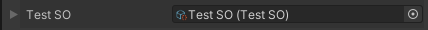
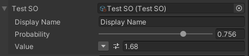
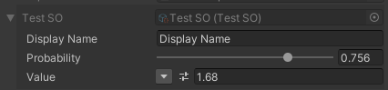
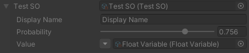
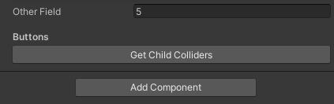
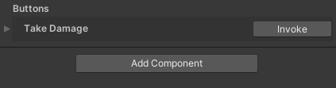
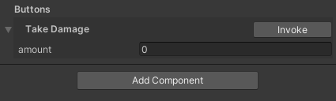

# Unity Helper Inspector

[](https://openupm.com/packages/com.mariodebono.inspector/)

This package provides some attributes and custom inspectors to help with development.

Attribution to original author in the code where other's code was used. Let me know if I have miss-attributed anyone.

I put together this package for reusability to meet my needs and later decided to make it public. This was not meant to be a package that covers all possible scenarios.

## Installation

### Package Manager Installation

Use the URL in the package manager window > Add... Add package from git URL...

```
 https://github.com/mariodebono/Unity-Helper-Inspector.git#release/stable
```


### Add in Manifest

Modify your `manifest.json` file found at `/PROJECTNAME/Packages/manifest.json` and add the following line:

```json
{
  "dependencies": {
    ...
    "com.mariodebono.inspector": "https://github.com/mariodebono/Unity-Helper-Inspector.git#release/stable",
    ...
  }
}
```

### OpenUPM

Install using openupm

URL:

```
https://openupm.com/packages/com.mariodebono.inspector
```

CLI:

```bash
openupm add com.mariodebono.inspector
```

---

## Features

- Interface Attribute for serializing iterfaces in inspector
- Read Only fields
- Inline Editor for objects
  - Supports ReadOnly On `Field` or `Field + Content`
- Inspector Button for method with no parameters
- Inspector Button for method with parameters
  - String
  - Float
  - Int32
  - Vector2
  - Vector3
  - Unity Objects (like ScriptableObject)

### Interface Attribute

Unity does not serialize interfaces, so interface types will not display in inspector. This is considered a workaround but solves the problem to an extent.

**Limitiations**
This works only for reference fields, these include `Components` (like MonoBehaviour) and `ScriptableObjects`, I normaly work with `UnityEngine.Object`.

_Examples:_

We use `UnityEngine.Object` as a base type for all unity objects

Lets say we have interface `IThing` and implementation:

```csharp
public interface IThing {

  public string ThingName { get; }

}

public class TestComponent : MonoBehaviour, IThing
{
    public string ThingName => this.name;
}

```

we can reference IThing in another script like so:

> Decorate with InterfaceAttribute and pass the interface type

```csharp

[SerializeField, Interface(typeof(IThing))] UnityEngine.Object thing;
private IThing Thing => thing as IThing;

private void Start()
{
  Debug.Log(Thing.ThingName);
}

```

**Inspector**

The field will show as a normal field


and


If you use a non referece type you get an error in the inspector


### ReadOnly

This attribute is self explanatory, makes a property in inspector readonly.

> This attributes considers `Custom Drawers`, It has not been heavily tested, if it breaks any of your drawers please let me know in the issues.

```csharp
  [SerializeField, ReadOnly] string readonlyString;

  //or
  [ReadOnly]
  [SerializeField] string readonlyString;
```

> The order of the attributes in your code matter, please see `InlineEditor` for different order features.

---

### InlineEditor

This attribute allows an object property to be editable in the inspector. This greatly saves time especially when using `ScriptableObjects`.

Adds a slightly darker background to easily follow children.

```csharp
[SerializedField, InlineEditor] TestSO testSO;
```

**No Object Reference**


**With Object Reference and Collapsed**



**With Object Reference and Expanded**



**Inline Editor With ReadOnly (GUI.enabled: false)**

When the inline editor is rendered it considers the GUI state.
You can Disable the field and let the contents be still editable or you can have everything marked as readonly.

_Content Editable, Field ReadOnly_

```csharp
    [InlineEditor] // 1 make the property InlineEditor
    [ReadOnly] // 2 set the property as Readonly
    [SerializeField] TestSO testSO;
```



_Field ReadOnly_

```csharp
    [ReadOnly] // 1 set the property as Readonly (GUI.enable: false)
    [InlineEditor] // 2 make the property InlineEditor with GUI.enable: false
    [SerializeField] TestSO testSO;
```



---

### Inspector Button

This is a handy tool to be able to execute buttons in the Editor, even when not playing.

> The inspector button works by overriding the default inspector for `MonoBehavior`. This should not break other inspector, if it does please report the issue.

Buttons are always added at the bottom of the inspector and does not allow you to change the location, only thr order of the buttons.

This is because buttons are added after the `DefaultInspector` is drawn.

Currently some method parameter types are supported

- String
- Float
- Int32
- Vector2
- Vector3
- Unity Objects (like ScriptableObject)

**Method with no parameters**

```csharp
  List<Collider> childColliders = new();

  [Button("Get Child Colliders")]
  void GetColliders()
  {
      GetComponentsInChildren(childColliders);
  }
```



**Support for method parameters**

The button will expand to expose the arguments to pass for the method parameters.

> When the method has parameters that are not supported, the `default` value is passed.

```csharp
  [Button("Take Damage")]
  public void TakeDamage(float amount){
    ///
  }
```

Collapsed



Expanded



Parameter Not Supported

```csharp
  [Button("Take Damage")]
  public void TakeDamage(float amount, SpecialClass effects)
  {
      ///
  }
```


---
